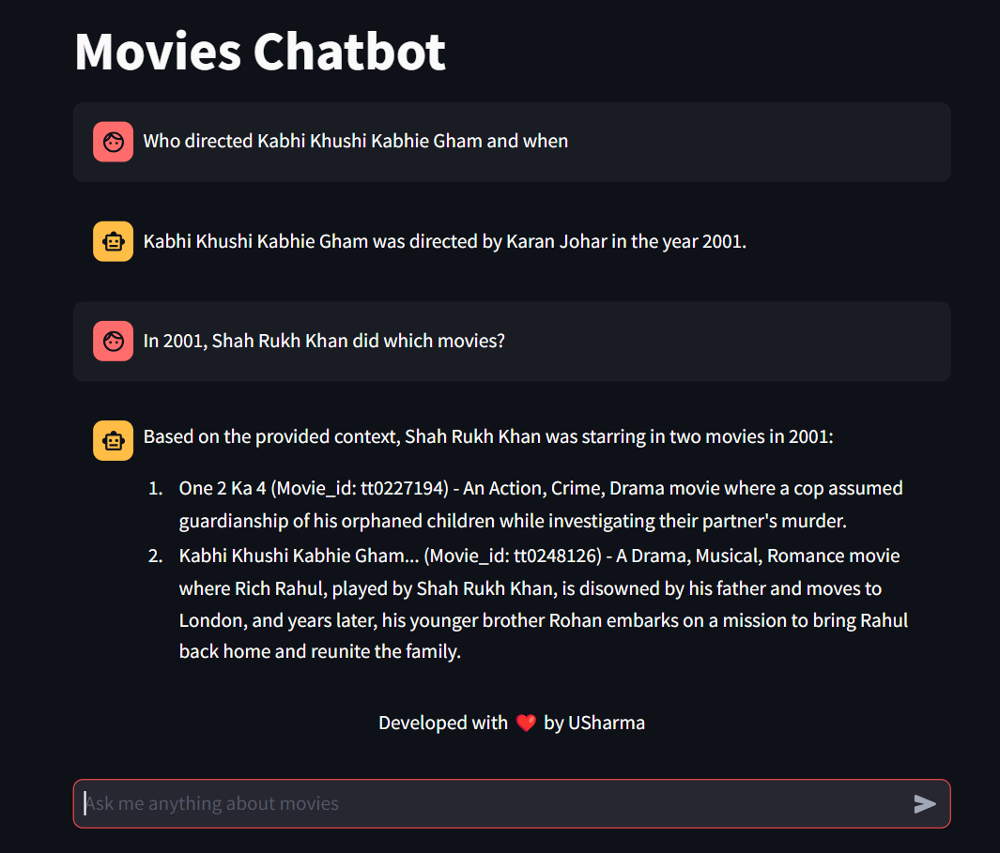

# Movies Chatbot
## Overview
This repository contains the code to build a chatbot that answers movie-specific queries.

The chatbot is built using the RAG Framework.

All the code is inside the [code](code) folder

## Images

- **Interface**.
  

- **Information about movies.** 

- **Generic Questions**

- **Breif Information**
  
